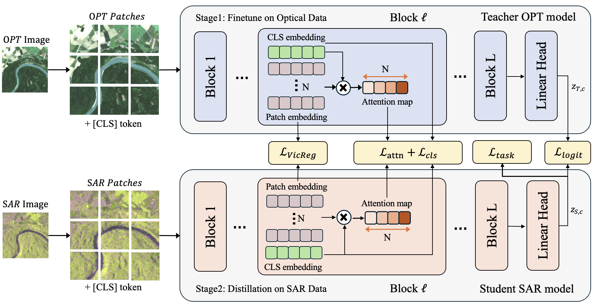
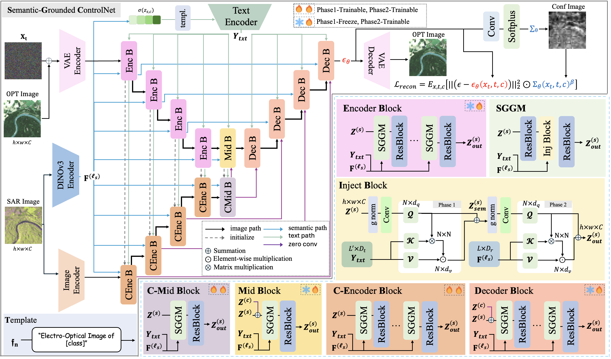

<div align="center">
<h2>OSCAR: Optical-aware Semantic Control for Aleatoric Refinement in Sar-to-Optical Translation</h2>

<div>
    <a href='https://www.linkedin.com/in/lee-hyunseo-8b0762362/' target='_blank'>Hyunseo Lee</a><sup>1</sup>&nbsp&nbsp&nbsp&nbsp;
    <a href='#' target='_blank'>Sang Min Kim</a><sup>1</sup>&nbsp&nbsp&nbsp&nbsp;
    <a href='#' target='_blank'>Ho kyung Shin</a><sup>1</sup>&nbsp&nbsp&nbsp&nbsp;
    <a href='#' target='_blank'>Taeheon Kim</a><sup>2</sup>&nbsp&nbsp&nbsp&nbsp;
    <a href='https://sites.google.com/view/prmi-knu/people?authuser=0' target='_blank'>Woo-Jeoung Nam</a><sup>1†</sup>
</div>
<br>
<div>
    <sup>†</sup>Co-corresponding authors</span>
</div>
<div>
    <sup>1</sup>Kyungpook National University</span>
</div>
<div>
    <sup>2</sup>Korea Aerospace Research Institute</span>
</div>

<div>
    <h4 align="center">
        <a href="https://eunoiahyunseo.github.io/OSCAR/" target='_blank'>
        
        </a>
        <a href="https://arxiv.org/abs/2601.06835" target='_blank'>
        
        </a>
        
    </h4>
</div>
</div>

---

<h4>
This repository is the official PyTorch implementation of "OSCAR: Optical-aware Semantic Control for Aleatoric Refinement in Sar-to-Optical Translation". OSCAR achieves state-of-the-art results on multiple datasets, outperforming the recent image-to-image translation methods and SAR-to-Optical image translation methods.
</h4>

---

## 📧 News
- **January 21, 2026:** Training scripts released for Optical-Aware SAR Encoder and Semantic-Grounded ControlNet
- **January 11, 2026:** This repository is created

## 📌 TODO
- [x] Optical-Aware Encoder
- [x] Semantic-Grounded ControlNet
- [ ] Dataset preprocess scripts
- [ ] Model zoo with drive


## 🔎 Overview Framework
### Optical-Aware SAR Encoder

### Semantic-Grounded ControlNet


---

## 🛠️ Installation

### Requirements
- Python >= 3.9
- PyTorch >= 2.0
- CUDA >= 11.8

```bash
pip install -r requirements.txt
```

### Pre-trained Models

| Model | Description | Download |
|-------|-------------|----------|
| DINOv3 ViT-L/16 | Pretrained backbone (SAT-493M) | [Download](https://drive.google.com/...) |
| Stable Diffusion 2.1 | Base diffusion model | [HuggingFace](https://huggingface.co/stabilityai/stable-diffusion-2-1-base) |

---

## 📊 Supported Datasets

| Dataset | Classes | Description |
|---------|---------|-------------|
| **BENv2** (BigEarthNet v2) | 19 | Multi-label land cover classification with Sentinel-1/2 imagery |
| **SEN12MS** | 11 | Multi-temporal Sentinel-1/2 dataset with LCCS land use labels |

---

## 🚀 Training Guide

OSCAR training consists of two main components:
1. **Optical-Aware SAR Encoder** - DINOv3 with knowledge distillation (`dino_final.py`)
2. **Semantic-Grounded ControlNet** - Diffusion model for SAR-to-Optical translation (`train_controlnet.py`)

---

## 1️⃣ Optical-Aware SAR Encoder Training

The Optical-Aware SAR Encoder uses a 2-stage training process with DINOv3 and LoRA:

| Stage | Description | Input | Output |
|-------|-------------|-------|--------|
| **Stage 0** | Train optical baseline (Teacher) | Optical images | Optical encoder checkpoint |
| **Stage 1** | Train SAR with knowledge distillation (Student) | SAR images + Teacher | SAR encoder checkpoint |

### BENv2 Dataset

#### Stage 0: Optical Baseline (Teacher)

```bash
CUDA_VISIBLE_DEVICES="0,1" torchrun --nproc_per_node=2 dino_final.py \
    --dataset benv2 \
    --stage 0 \
    --data_type opt \
    --output_dir ./checkpoints/benv2/stage0_opt \
    --dinov3_repo /path/to/dinov3 \
    --dinov3_pretrained_weights ./dinov3_vitl16_pretrain_sat493m-eadcf0ff.pth \
    --dataset_images_lmdb /path/to/Encoded-BigEarthNet \
    --dataset_metadata_parquet /path/to/metadata.parquet \
    --dataset_metadata_snow_cloud_parquet /path/to/metadata_for_patches_with_snow_cloud_or_shadow.parquet \
    --batch_size 72 \
    --num_epochs 100 \
    --learning_rate_base 1e-4
```

#### Stage 1: SAR with Knowledge Distillation (Student)

```bash
CUDA_VISIBLE_DEVICES="0,1" torchrun --nproc_per_node=2 dino_final.py \
    --dataset benv2 \
    --stage 1 \
    --data_type sar \
    --teacher_checkpoint ./checkpoints/benv2/stage0_opt/checkpoint_stage0_epoch100.pth \
    --output_dir ./checkpoints/benv2/stage1_sar \
    --dinov3_repo /path/to/dinov3 \
    --dinov3_pretrained_weights ./dinov3_vitl16_pretrain_sat493m-eadcf0ff.pth \
    --dataset_images_lmdb /path/to/Encoded-BigEarthNet \
    --dataset_metadata_parquet /path/to/metadata.parquet \
    --dataset_metadata_snow_cloud_parquet /path/to/metadata_for_patches_with_snow_cloud_or_shadow.parquet \
    --batch_size 72 \
    --num_epochs 100 \
    --learning_rate_base 1e-4
```

### SEN12MS Dataset

#### Stage 0: Optical Baseline (Teacher)

```bash
CUDA_VISIBLE_DEVICES="0,1" torchrun --nproc_per_node=2 dino_final.py \
    --dataset sen12ms \
    --stage 0 \
    --data_type opt \
    --sen12ms_root_dir ./sen12ms \
    --output_dir ./checkpoints/sen12ms/stage0_opt \
    --dinov3_repo /path/to/dinov3 \
    --dinov3_pretrained_weights ./dinov3_vitl16_pretrain_sat493m-eadcf0ff.pth \
    --batch_size 72 \
    --num_epochs 100
```

#### Stage 1: SAR with Knowledge Distillation (Student)

```bash
CUDA_VISIBLE_DEVICES="0,1" torchrun --nproc_per_node=2 dino_final.py \
    --dataset sen12ms \
    --stage 1 \
    --data_type sar \
    --teacher_checkpoint ./checkpoints/sen12ms/stage0_opt/checkpoint_stage0_epoch100.pth \
    --output_dir ./checkpoints/sen12ms/stage1_sar \
    --sen12ms_root_dir ./sen12ms \
    --dinov3_repo /path/to/dinov3 \
    --dinov3_pretrained_weights ./dinov3_vitl16_pretrain_sat493m-eadcf0ff.pth \
    --batch_size 72 \
    --num_epochs 100
```

### Key Arguments for `dino_final.py`

| Argument | Description | Default |
|----------|-------------|---------|
| `--dataset` | Dataset to use: `benv2` or `sen12ms` | `benv2` |
| `--stage` | Training stage: `0` (optical) or `1` (SAR distillation) | Required |
| `--data_type` | Data type: `opt` (optical) or `sar` | Required |
| `--teacher_checkpoint` | Path to teacher checkpoint (required for stage 1) | None |
| `--batch_size` | Batch size per GPU | 72 |
| `--num_epochs` | Number of training epochs | 100 |
| `--learning_rate_base` | Learning rate for LoRA and classifier | 1e-4 |
| `--lora_rank` | LoRA rank | 8 |
| `--lora_alpha` | LoRA alpha | 16 |
| `--layers_to_distill` | ViT layers for feature extraction | [11,14,17,20,23] |

---

## 2️⃣ Semantic-Grounded ControlNet Training

The Semantic-Grounded ControlNet uses Stable Diffusion 2.1 with ControlNet for SAR-to-Optical image synthesis.

### BENv2 Dataset

```bash
CUDA_VISIBLE_DEVICES="0,1" accelerate launch train_seesr.py \
    --dataset benv2 \
    --pretrained_model_name_or_path "./stable-diffusion-2-1-base/stable-diffusion-2-1-base" \
    --output_dir "./checkpoints/benv2/controlnet" \
    --dino_checkpoint "./checkpoints/benv2/stage1_sar/checkpoint_stage1_epoch100.pth" \
    --dino_repo_path /path/to/dinov3 \
    --dino_weights ./dinov3_vitl16_pretrain_sat493m-eadcf0ff.pth \
    --images_lmdb /path/to/Encoded-BigEarthNet \
    --metadata_parquet /path/to/metadata.parquet \
    --metadata_snow_cloud_parquet /path/to/metadata_for_patches_with_snow_cloud_or_shadow.parquet \
    --mixed_precision "bf16" \
    --resolution 256 \
    --learning_rate 5e-5 \
    --train_batch_size 8 \
    --gradient_accumulation_steps 4 \
    --checkpointing_steps 1000 \
    --max_train_steps 100000 \
    --report_to wandb \
    --lr_scheduler "cosine" \
    --lr_warmup_steps 100 \
    --gradient_checkpointing \
    --use_8bit_adam \
    --set_grads_to_none \
    --enable_xformers_memory_efficient_attention \
    --trainable_modules "image_attentions" "conv_out_conf"
```

### SEN12MS Dataset

```bash
CUDA_VISIBLE_DEVICES="0,1" accelerate launch train_seesr.py \
    --dataset sen12ms \
    --sen12ms_root "./sen12ms" \
    --sen12ms_dino_checkpoint "./checkpoints/sen12ms/stage1_sar/checkpoint_stage1_epoch100.pth" \
    --pretrained_model_name_or_path "./stable-diffusion-2-1-base/stable-diffusion-2-1-base" \
    --output_dir "./checkpoints/sen12ms/controlnet" \
    --dino_repo_path /path/to/dinov3 \
    --dino_weights ./dinov3_vitl16_pretrain_sat493m-eadcf0ff.pth \
    --mixed_precision "bf16" \
    --resolution 256 \
    --learning_rate 5e-5 \
    --train_batch_size 8 \
    --gradient_accumulation_steps 4 \
    --checkpointing_steps 1000 \
    --max_train_steps 100000 \
    --report_to wandb \
    --lr_scheduler "cosine" \
    --lr_warmup_steps 100 \
    --gradient_checkpointing \
    --use_8bit_adam \
    --set_grads_to_none \
    --enable_xformers_memory_efficient_attention \
    --trainable_modules "image_attentions" "conv_out_conf"
```

### Key Arguments for `train_seesr.py`

| Argument | Description | Default |
|----------|-------------|---------|
| `--dataset` | Dataset to use: `benv2` or `sen12ms` | `benv2` |
| `--pretrained_model_name_or_path` | Path to Stable Diffusion 2.1 base | Required |
| `--output_dir` | Output directory for checkpoints | Required |
| `--dino_checkpoint` | Path to DINOv3 SAR encoder checkpoint (BENv2) | Required |
| `--sen12ms_dino_checkpoint` | Path to DINOv3 SAR encoder checkpoint (SEN12MS) | Required for SEN12MS |
| `--sen12ms_root` | Root directory for SEN12MS dataset | `./sen12ms` |
| `--train_batch_size` | Batch size per GPU | 8 |
| `--gradient_accumulation_steps` | Gradient accumulation steps | 4 |
| `--learning_rate` | Learning rate | 5e-5 |
| `--max_train_steps` | Maximum training steps | 100000 |
| `--trainable_modules` | Modules to train | `["image_attentions", "conv_out_conf"]` |
| `--mixed_precision` | Mixed precision training: `no`, `fp16`, `bf16` | `bf16` |

### Resume Training

To resume from a checkpoint:

```bash
accelerate launch train_seesr.py \
    --resume_from_checkpoint "./checkpoints/benv2/controlnet/checkpoint-50000" \
    ... # other arguments
```

---

## 📁 Project Structure

```
OSCAR/
├── dino_final.py              # Optical-Aware SAR Encoder training
├── train_seesr.py             # Semantic-Grounded ControlNet training
├── test_seesr.py              # Unified evaluation script (BENv2/SEN12MS)
├── sen12ms_dataloader.py      # SEN12MS dataset loader
├── models/
│   ├── controlnet.py          # ControlNet architecture
│   ├── unet_2d_condition.py   # UNet with image cross-attention
│   └── unet_2d_blocks.py      # UNet building blocks
├── pipelines/
│   └── pipeline_seesr.py      # SeeSR inference pipeline
├── utils/
│   ├── transforms.py          # Data transforms for SAR/Optical
│   ├── prompts.py             # Class prompts and prompt generation
│   ├── dataloaders.py         # Dataset utilities
│   ├── models.py              # Model utilities
│   ├── metrics.py             # Image quality metrics (QNR, SAM, SCC, RMSE)
│   ├── pipeline.py            # Pipeline utilities
│   ├── validation.py          # Validation utilities
│   └── wavelet_color_fix.py   # Post-processing color correction
├── scripts/
│   ├── benv2/
│   │   ├── dino_stage_0.sh    # BENv2 optical encoder training
│   │   ├── dino_stage_1.sh    # BENv2 SAR encoder training
│   │   └── train_controlnet.sh # BENv2 ControlNet training
│   └── sen12ms/
│       ├── dino_stage_0.sh    # SEN12MS optical encoder training
│       ├── dino_stage1.sh     # SEN12MS SAR encoder training
│       └── train_controlnet.sh # SEN12MS ControlNet training
└── stable-diffusion-2-1-base/ # Stable Diffusion weights
```

---

## 🔬 Evaluation

The unified `test_seesr.py` script supports both BENv2 and SEN12MS datasets through the `--dataset` argument.

### BENv2 Dataset

```bash
python test_seesr.py \
    --dataset benv2 \
    --checkpoint_dir "./checkpoints/benv2/controlnet/checkpoint-100000" \
    --base_model_path "./stable-diffusion-2-1-base/stable-diffusion-2-1-base" \
    --dino_weights "./dinov3_vitl16_pretrain_sat493m-eadcf0ff.pth" \
    --dino_checkpoint "./checkpoints/benv2/stage1_sar/checkpoint_stage1_epoch100.pth" \
    --images_lmdb /path/to/Encoded-BigEarthNet \
    --metadata_parquet /path/to/metadata.parquet \
    --metadata_snow_cloud_parquet /path/to/metadata_for_patches_with_snow_cloud_or_shadow.parquet \
    --output_dir "./validation_results/benv2" \
    --num_samples 1000 \
    --num_inference_steps 50 \
    --guidance_scale 5.5
```

### SEN12MS Dataset

```bash
python test_seesr.py \
    --dataset sen12ms \
    --sen12ms_root "./sen12ms" \
    --checkpoint_dir "./checkpoints/sen12ms/controlnet/checkpoint-100000" \
    --base_model_path "./stable-diffusion-2-1-base/stable-diffusion-2-1-base" \
    --dino_weights "./dinov3_vitl16_pretrain_sat493m-eadcf0ff.pth" \
    --dino_checkpoint "./checkpoints/sen12ms/stage1_sar/checkpoint_stage1_epoch100.pth" \
    --output_dir "./validation_results/sen12ms" \
    --num_samples 3000 \
    --num_inference_steps 50 \
    --guidance_scale 5.5
```

### Evaluate External Generated Images

Skip image generation and evaluate pre-generated images:

```bash
python test_seesr.py \
    --dataset benv2 \
    --external_folder "./external_generated_images" \
    --dino_weights "./dinov3_vitl16_pretrain_sat493m-eadcf0ff.pth" \
    --dino_checkpoint "./checkpoints/benv2/stage1_sar/checkpoint_stage1_epoch100.pth" \
    --output_dir "./validation_results/external"
```

### Key Arguments for `test_seesr.py`

| Argument | Description | Default |
|----------|-------------|---------|
| `--dataset` | Dataset to use: `benv2` or `sen12ms` | `benv2` |
| `--checkpoint_dir` | Path to trained ControlNet checkpoint | Required |
| `--base_model_path` | Path to Stable Diffusion 2.1 base | Required |
| `--dino_weights` | Path to DINOv3 pretrained weights | Required |
| `--dino_checkpoint` | Path to DINOv3 classifier checkpoint | Required |
| `--output_dir` | Output directory for results | `./validation_results` |
| `--num_samples` | Number of samples to evaluate | 1000 |
| `--batch_size` | Evaluation batch size | 20 |
| `--external_folder` | Path to external generated images (skip generation) | None |
| `--num_inference_steps` | Diffusion inference steps | 50 |
| `--guidance_scale` | Classifier-free guidance scale | 5.5 |
| `--mixed_precision` | Mixed precision mode: `no`, `fp16`, `bf16` | `bf16` |

### Evaluation Metrics

The evaluation script computes the following metrics:

**Perceptual Metrics:**
- PSNR (Peak Signal-to-Noise Ratio)
- SSIM (Structural Similarity Index)
- LPIPS (Learned Perceptual Image Patch Similarity)
- DISTS (Deep Image Structure and Texture Similarity)

**Remote Sensing Metrics:**
- QNR (Quality with No Reference)
- SAM (Spectral Angle Mapper)
- SCC (Spatial Correlation Coefficient)
- RMSE (Root Mean Square Error)

**Generative Metrics:**
- FID (Fréchet Inception Distance)
- KID (Kernel Inception Distance)
- ISC (Inception Score)

---

## 📈 Results

Please visit our [project page](https://eunoiahyunseo.github.io/OSCAR/) for more experimental results.

### Quantitative Results

| Method | Dataset | PSNR ↑ | SSIM ↑ | LPIPS ↓ | FID ↓ |
|--------|---------|--------|--------|---------|-------|
| OSCAR | BENv2 | - | - | - | - |
| OSCAR | SEN12MS | - | - | - | - |

---

## 📝 Citation

If you find this work useful, please cite our paper:

```bibtex
@article{lee2026oscar,
  title={OSCAR: Optical-aware Semantic Control for Aleatoric Refinement in SAR-to-Optical Translation},
  author={Lee, Hyunseo and Kim, Sang Min and Shin, Ho kyung and Kim, Taeheon and Nam, Woo-Jeoung},
  journal={arXiv preprint arXiv:2601.06835},
  year={2026}
}
```

---

## 📜 License

The source codes including the checkpoint can be freely used for research and education only. Any commercial use should get formal permission from the principal investigator (Prof. Woo-Jeoung Nam, nwj0612@knu.ac.kr) or main author (Hyunseo Lee, heart2002101@knu.ac.kr).

---

## 🙏 Acknowledgements

This project builds upon the following works:
- [DINOv3](https://github.com/facebookresearch/dinov3) - Vision Transformer backbone
- [Stable Diffusion](https://github.com/Stability-AI/stablediffusion) - Diffusion model
- [ControlNet](https://github.com/lllyasviel/ControlNet) - Conditional control for diffusion models


## Star History

[](https://www.star-history.com/#eunoiahyunseo/OSCAR&type=date&legend=top-left)
