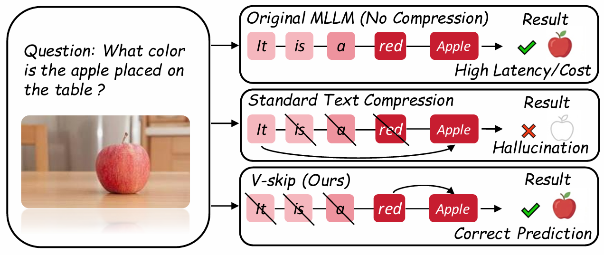

# V-skip

**V-Skip: Efficient Multimodal Reasoning via Dual-Path Anchoring**
 
[Dongxu Zhang](https://dongxu-zhang.github.io/)1,*, [Yiding Sun](https://github.com/Issac-Sun)1,*, [Cheng Tan](https://chengtan9907.github.io/)3, [Wenbiao Yan](#)4, [Ning Yang](http://ningyangcasia.cn/)2,†, [Jihua Zhu](https://gr.xjtu.edu.cn/web/zhujh)1,†, [Haijun Zhang](https://scce.ustb.edu.cn/shiziduiwu/jiaoshixinxi/2018-04-13/100.html)5

1Xi'an Jiaotong University, 2CASIA, 3Shanghai AI Laboratory, 4HITSZ, 5USTB

---

## 🚀 Introduction

This repository contains the official implementation (and project page source) for the paper **"Chain-of-Thought Compression Should Not Be Blind: V-Skip for Efficient Multimodal Reasoning via Dual-Path Anchoring"**.

**V-Skip** is a novel token pruning framework designed for Multimodal Large Language Models (MLLMs). It solves the **"Visual Amnesia"** problem found in standard text-centric compression methods. By employing a dual-path gating mechanism (Linguistic Surprisal + Visual Attention Flow), V-Skip preserves visually salient tokens while reducing latency.

*Figure 1: Comparison of compression paradigms. V-Skip successfully rescues visual anchors (e.g., "red") that are blindly pruned by text-only methods.*

## 📈 Key Results
- **Speedup:** Achieves **2.9x** inference speedup on Qwen2-VL.
- **Accuracy:** Outperforms baselines by over **30%** on the DocVQA benchmark.
- **Robustness:** Effectively prevents object hallucination caused by over-pruning.

## 🛠️ Usage
